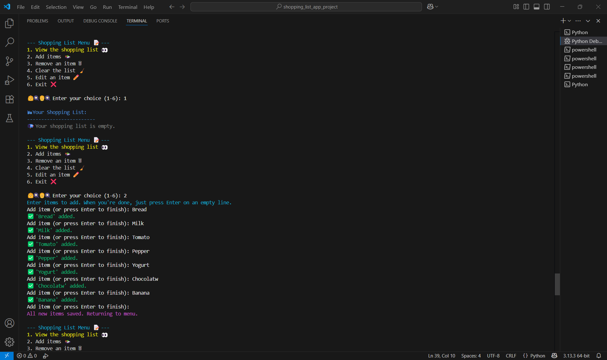
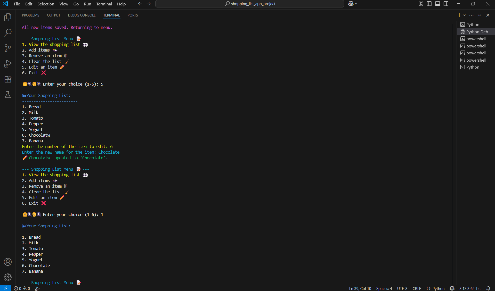
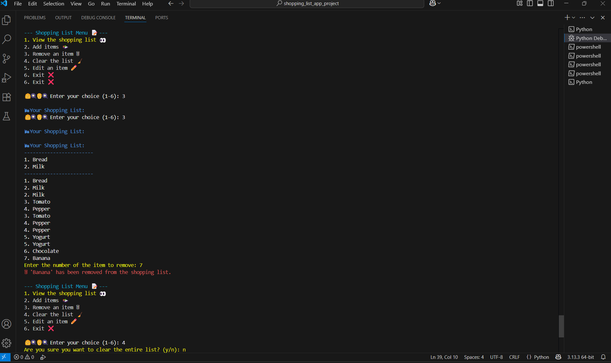
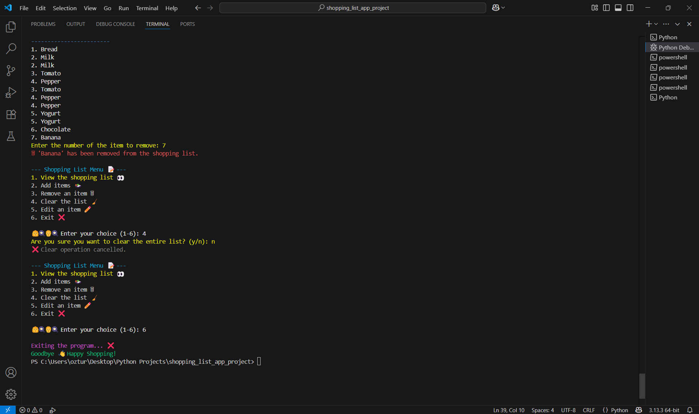

# 🛒 Shopping List App (Python)

A terminal-based shopping list manager built with Python, using `colorama` for colorful output and file persistence.

---

## ✨ Features

- View current shopping list with colors  
- Add multiple items at once  
- Edit or remove specific items  
- Clear entire list with confirmation prompt  
- Persistent shopping list saved to `shopping_list.txt`  
- User-friendly and colorful terminal interface using `colorama`  

---
## 🖼️ Screenshots

### Viewing and Adding Items  
  
Here you can see the shopping list displayed, and new items being added seamlessly.

### Editing Items  
  
This screenshot shows how an existing item in the list is edited.

### Removing Items  
  
Demonstration of removing an item from the shopping list.

### Exiting the Application  
  
Final step showing the program exit message and graceful shutdown.


## 🚀 How to Run

1. Clone the repo or download the files  
2. Make sure Python 3 is installed  
3. Install `colorama` library if you haven't already:
   ```bash
   pip install colorama